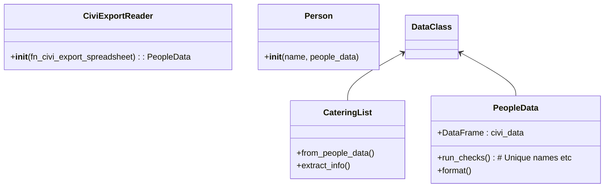

# Class Structures

```mermaid
    classDiagram
        
        class PeopleData{
            +DataFrame : civi_data
            +run_checks() # Unique names etc
            +format()
        }

        class CateringList{
            +from_people_data()
            +extract_info()
        }

        class CiviExportReader{
            +__init__(fn_civi_export_spreadsheet) : PeopleData
        }

        class Person{
            +__init__(name, people_data)
        }

        class DataClass{
            
        }

        DataClass <-- CateringList
        DataClass <-- PeopleData
```