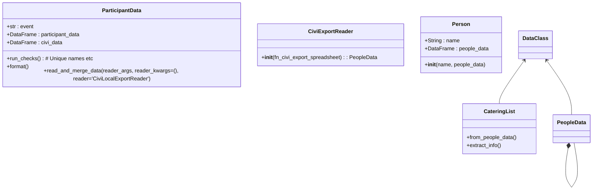

# Class Structures

The diagram below gives an overview of the planned classes.

```mermaid
    classDiagram
        
        class ParticipantData{
            +str : event
            +DataFrame : participant_data
            +DataFrame : civi_data
            +run_checks() # Unique names etc
            +format()
            +read_and_merge_data(reader_args, reader_kwargs=(), reader='CiviLocalExportReader')
        }

        class CateringList{
            +from_people_data()
            +extract_info()
        }

        class CiviExportReader{
            +__init__(fn_civi_export_spreadsheet) : PeopleData
        }

        class Person{
            +String : name
            +DataFrame : people_data
            +__init__(name, people_data)
        }

        class DataClass{

        }

        DataClass <-- CateringList
        DataClass <-- PeopleData
        PeopleData *-- PeopleData
```